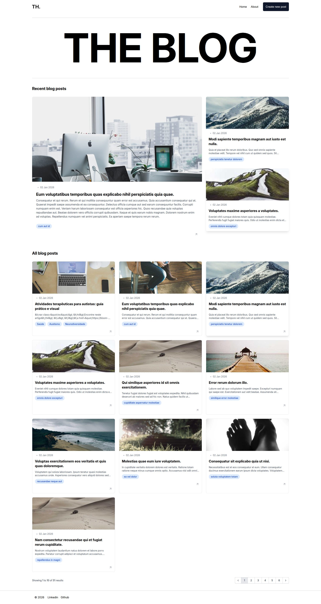
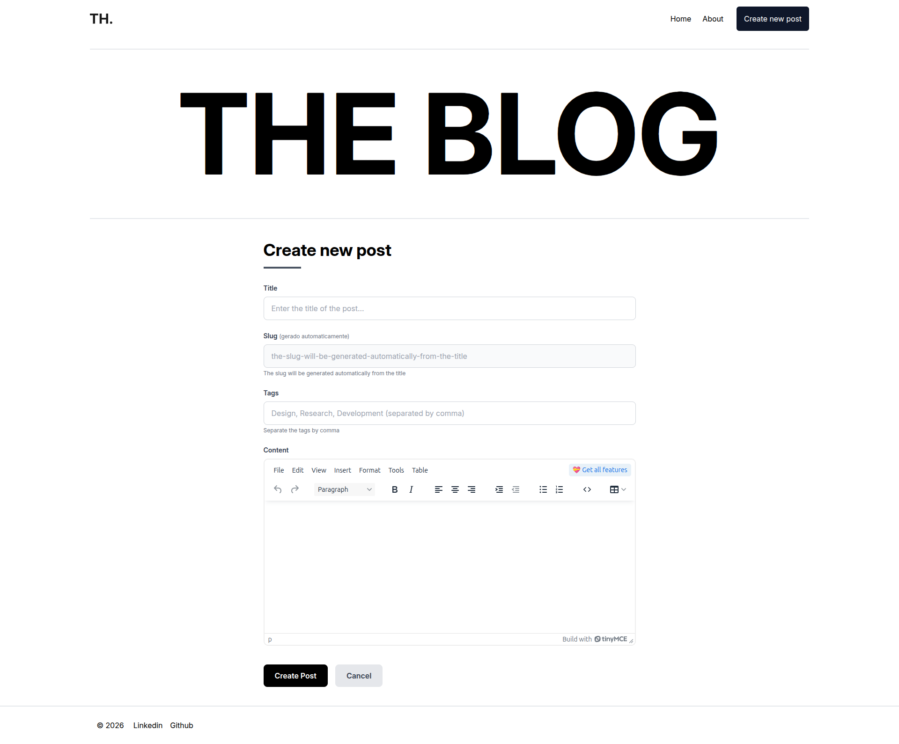
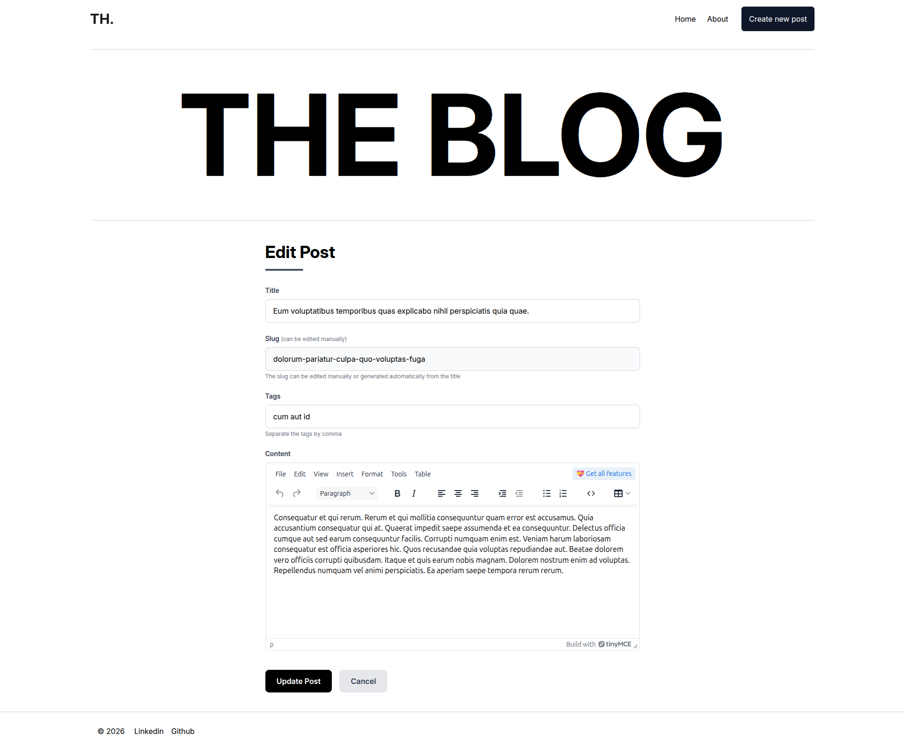

# THE BLOG

Um blog construído com Laravel e Blade para praticar e consolidar os conhecimentos básicos.

## 🚀 Tecnologias Utilizadas

- **Laravel 12** - Framework PHP
- **Blade** - Template Engine
- **Tailwind CSS 4** - Framework CSS
- **TinyMCE** - Editor de texto rico
- **PHP 8.4** - Linguagem Backend

## 📸 Screenshots

### Home Page

### Create Post Page

### Read Post Page

### Edit Post Page

## ✨ Funcionalidades

- ✅ Criação de posts com editor rico (TinyMCE)
- ✅ Edição de posts existentes
- ✅ Visualização de posts com formatação HTML
- ✅ Geração automática de slug a partir do título
- ✅ Sistema de tags
- ✅ Design responsivo
- ✅ Menu mobile com animações

## 🎯 Objetivos do Projeto

Este projeto foi desenvolvido com o objetivo de:
- Praticar e consolidar conhecimentos em Laravel e Blade
- Desenvolver componentes reutilizáveis e bem estruturados
- Implementar design responsivo e moderno
- Aprender boas práticas de desenvolvimento web

## 📝 Estrutura

- **Posts**: Sistema completo de CRUD para posts
- **Componentes Blade**: Componentes reutilizáveis para cards, navbar, etc.
- **Responsividade**: Design adaptável para mobile e desktop
- **Editor Rich Text**: Integração com TinyMCE para edição de conteúdo

## 🛠️ Como Executar

# Instalar dependências
composer install
npm install

# Configurar ambiente
cp .env.example .env
php artisan key:generate

# Executar migrations
php artisan migrate

# Executar seeders (opcional)
php artisan db:seed

# Iniciar servidor
php artisan serve

# Compilar assets (em outro terminal)
npm run dev## 📄 Licença

Este é um projeto de aprendizado e prática.